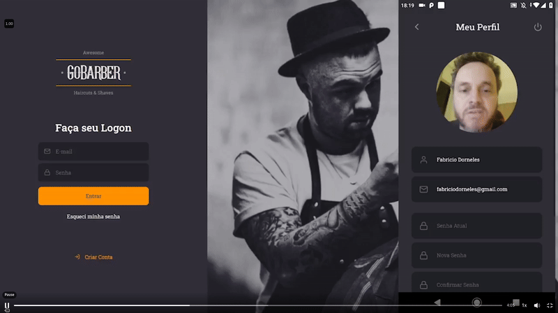

<h1 align="center">
     
    <br>
    <br>Full Stack Application<br/>
    <br>
    Node.js | ReactJS | React Native
</h1>

<p align="center">
  
  

</p>
<p align="center">
  <a href="#-about">✂ About</a>&nbsp;&nbsp;&nbsp;|&nbsp;&nbsp;&nbsp;
  <a href="#-screenshots">✂ Screenshots</a>&nbsp;&nbsp;&nbsp;|&nbsp;&nbsp;&nbsp;
  <a href="#-technologies-used">🛠 Technologies</a>&nbsp;&nbsp;&nbsp;|&nbsp;&nbsp;&nbsp;
  <a href="#-download-and-run-the-project-backend">🔬 Download and Run</a>
</p>
<h1 align="center"> </h1>

<h2 align="center">✂ About</h2>
<p align="center">
  <strong>Barbershop</strong> Management. Service Provider Registration, User Registration, Service Scheduling.<br>
  Backend, Frontend and Mobile.
</p>

## ✂ Screenshots

<div align="center">
  <table>
    <tr>
      <td align="center">
        
        <br />
        <b>Login Screen</b>
      </td>
    </tr>
    <tr>
      <td align="center">
        
        <br />
        <b>Web Login</b>
      </td>
    </tr>
    <tr>
      <td align="center">
        
        <br />
        <b>Appointment Scheduling</b>
      </td>
    </tr>
    <tr>
      <td align="center">
        
        <br />
        <b>Profile Photo</b>
      </td>
    </tr>
  </table>
</div>

## 🛠 Technologies Used

### Core:
- [React](https://pt-br.reactjs.org/)
- [React Native](https://reactnative.dev/)
- [NodeJS](https://nodejs.org/en/)
- [TypeScript](https://www.typescriptlang.org/)

### Secondary:
- [Express](https://expressjs.com/pt-br/)
- [Docker]()
- [Typeorm](https://typeorm.io/#/)
- [PostgreSQL](https://www.postgresql.org/)
- [Styled Components](https://styled-components.com/)
- [Jest](https://jestjs.io/)
- [Unform(RocketSeat)](https://unform.dev/)
- [React Spring](https://www.react-spring.io/)
- [Tsyringe]()
- [nodemailer]()
- [Ethereal(Fake SMTP)]()
- [HandleBars(Node Template Engine)]()
- [ESLint](https://eslint.org/)
- [Prettier](https://prettier.io/)
- [EditorConfig](https://editorconfig.org/)


## 🔬 Download and Run the Project (Backend)
```bash
# Clone Repository
$ git clone https://github.com/fabriciodorneles/Go-Barber.git

# Enter Directory
$ cd go-barber

# Install Dependencies
$ yarn

# Start the Project
$ yarn dev:server

